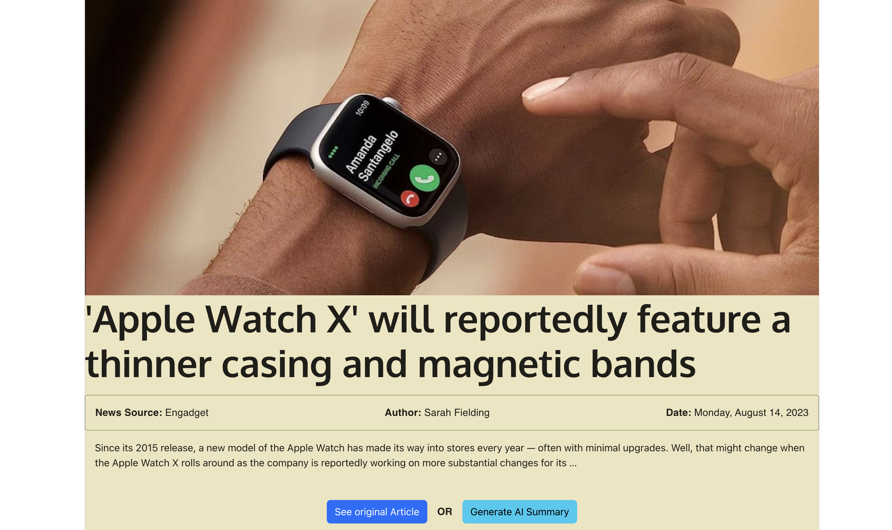

<a id="readme-top"></a>

<br />
<div align="center">
    
  <h3 align="center">Weather and News Application</h3>

  <p align="center">
    An application to access the news and weather concisely
    <br />
    <br />
    <br />
    <a href="https://github.com/kargeq/weatherNewsAPP/issues">Report Bug</a>
    ·
    <a href="https://github.com/kargeq/weatherNewsAPP/issues">Request Feature</a>
  </p>
</div>


<!-- TABLE OF CONTENTS -->
<details>
  <summary>Table of Contents</summary>
  <ol>
    <li>
      <a href="#about-the-project">About The Project</a>
    </li>
    <li>
      <a href="#getting-started">Getting Started</a>
      <ul>
        <li><a href="#prerequisites">Prerequisites</a></li>
        <li><a href="#installation">Installation</a></li>
      </ul>
    </li>
    <li><a href="#contributing">Contributing</a></li>
    <li><a href="#license">License</a></li>
  </ol>
</details>


<!-- ABOUT THE PROJECT -->
## About The Project


There are sites that contain the weather and news , I didn't find one that really suited my needs so I created this enhanced one. 
Here's why:
* Weather and News Sites often have unnessary info which slows the process of getting info
* News Sites with articles attatched should have a summary feature to allow users to see the summary
* The summary should be concise

The following project has the following features:
* Shows weather info (hourly and daily), searchable by zipcode or by state
  <br>
  
  
* For News, the ability to search for news while also having the ability to summarize articles
   <br>
  
  

  
* Article sumamries garunteed to be 5 sentences
 <br>
 

<p align="right">(<a href="#readme-top">back to top</a>)</p>

<!-- GETTING STARTED -->
## Getting Started

This is an example of how you may give instructions on setting up your project locally.
To get a local copy up and running follow these simple example steps.

### Prerequisites

This project uses react and the following APIs:
* [MeaningCloud Summarizatiion](https://www.meaningcloud.com/products/automatic-summarization)
* [Pexels](https://www.pexels.com/api/)
* [NewsApi](https://newsapi.org/)
* [OpenWeather OneCall 3.0](https://openweathermap.org/api)

### Installation

_Below is an example of how you can instruct your audience on installing and setting up your app. This template doesn't rely on any external dependencies or services._

1. Clone the repo
   ```sh
   git clone https://github.com/kargeq/weatherNewsAPP.git
   ```
2. Install NPM packages
   ```sh
   npm install
   ```
3. create a .env folder in the root directory

4. add the API keys mentioned in the [Prerequisites](https://github.com/kargeq/weatherNewsAPP#Prerequisites)
   ```js
   REACT_APP_News_API_KEY=YOUR_NEWS_API KEY goes here
   REACT_APP_WEATHER_LOCATION_API_KEY=Your Open Weather API GOES HERE
   REACT_APP_WEATHER_PIXEL_API_KEY=YOUR PEXELS API GOES HERE
   REACT_APP_SUMMARY_API_KEY=YOUR SUMMARIZATION API GOES HERE
   ```

<p align="right">(<a href="#readme-top">back to top</a>)</p>

<!-- CONTRIBUTING -->
## Contributing

Contributions are what make the open source community such an amazing place to learn, inspire, and create. Any contributions you make are **greatly appreciated**.

If you have a suggestion that would make this better, please fork the repo and create a pull request. You can also simply open an issue with the tag "enhancement".
Don't forget to give the project a star! Thanks again!

1. Fork the Project
2. Create your Feature Branch (`git checkout -b feature/AmazingFeature`)
3. Commit your Changes (`git commit -m 'Add some AmazingFeature'`)
4. Push to the Branch (`git push origin feature/AmazingFeature`)
5. Open a Pull Request

<p align="right">(<a href="#readme-top">back to top</a>)</p>


<!-- LICENSE -->
## License

Distributed under the MIT License.

<p align="right">(<a href="#readme-top">back to top</a>)</p>


